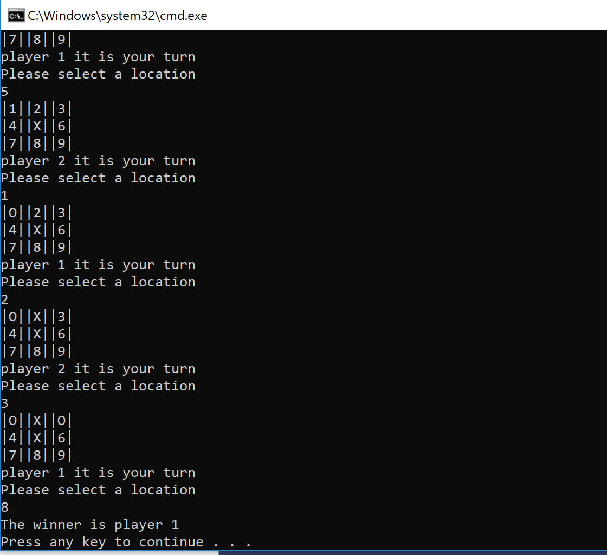

# LAB04-TicTacToe
This is a Tic Tac Toe game using .NET Core console application written in C#. 
# Sample View

# Load Application
in terminal: git clone open in visual studio run project without debugging

# License
This project is licensed under the MIT license.

